<div align="center">
  
  
<hr>

**An interactive map-based quiz game with British trivia questions. Answer the question by choosing the correct region on the map.**

This site was built using [GitHub Pages](https://pages.github.com/).

**How well do you know Britain??**

[Take the Quiz](https://lucyjpjones.github.io/LucyJones-BRITbrAIN/)

</div>

---

## <u>Table of contents</u>

- [&rarr; **User Experience (UX)**](#-rarr----user-experience--ux---)
  - [Purpose](#purpose)
  - [User stories](#user-stories)
  - [Design](#design)
  - [Wireframes](#wireframes)
- [&rarr; **Features**](#-rarr----features--)
  - [Features used](#features-used)
  - [To-do list](#to-do-list)
  - [Status](#status)
- [&rarr; **Technologies**](#-rarr----technologies--)
  - [Languages](#languages)
  - [Frameworks, Libraries & Programs](#frameworks--libraries---programs)
- [&rarr; **Deployment**](#-rarr----deployment--)
  - [Deploy to Github](#deploy-to-github)
  - [Accessing code](#accessing-code)
- [&rarr; **Testing**](#-rarr----testing--)
  - [Testing user stories](#testing-user-stories)
  - [Manual function testing](#manual-function-testing)
  - [Validator checks](#validator-checks)
  - [Audits](#audits)
  - [Responsive Design](#responsive-design)
  - [Additional Testing](#additional-testing)
  - [Bugs](#bugs)
- [&rarr; **Credits**](#-rarr----credits--)
  - [Content](#content)
  - [Media](#media)
  - [Acknowledgements](#acknowledgements)
- [&rarr; **Contact**](#-rarr----contact--)

---

# &rarr; **User Experience (UX)**

#### Purpose

The purpose of this site is to create a fun interactive quiz for the user whilst developing both their general and geographical knowledge of Britain. My decision to create this site was based on a family interest in map games and my lack of general knowledge on Britain. By completing this project I will have shown greater experience using Javascript and hopefully expanded my knowledge on Britain.

#### User stories

The <u>key priorities</u> for my user are as follows:

1. A user-friendly site that is easy to navigate.

2. An enjoyable, interactive quiz to play.

3. An easily accessible button to start the quiz.

4. Clear instructions for the user on how to play.

5. Recorded score and leaderboard, for the user to check personal performance and ranking against other players.

6. A question counter to keep track of the user's progress throughout the quiz.

7. A quiz timer.

8. Ability to contact me through an online form.

9. About us and features section on site.

10. Links to external social media sites.

#### Design

- **Structure**

  - A simple design structure with a fixed dropdown menu and scroll arrows to allow easy navigation throughout the site.

- **Colour scheme**

  - The colour scheme is primarily based around peaches in association with the brain and extra colours were added to compliment the palette using [Coolors](https://coolors.co).
  - I have used the 'opacity' property to create lighter and darker shades throughout the site.

    

- **Typography**

  - The main font used throughout the site is 'Raleway' which belongs to the sans-serif typeface family. The font is clean and elegant, making it a good choice for web design.

  - I have used 'Ranchers' font for the 'BRITbrAIN' title as it is fun and pairs well with the Brain theme.

  - Sans Serif as the fallback font if for any reason the font isn't being imported into the site correctly.

#### Wireframes

As part of the design process, before starting my project I sketched out initial drawings then used <u>Balsamiq</u> to create sharper-looking wireframes. Creating these mock-ups helped me plan the basic structure and arrangement of the features for my site.

[view initial drawings](assets/images/readme/initial-drawing.jpg)

[View wireframes](assets/files/wireframes.pdf)

- **Wireframes vs. finished project**

  During the making of my site I made some amendments from the ideas presented on my original wireframes;

| Wireframes                     | End site                                     | Reason                                                                                                            |
| ------------------------------ | -------------------------------------------- | ----------------------------------------------------------------------------------------------------------------- |
| Timer: 10 seconds per question | Timer: 30 seconds for overall game           | Greater user interaction to race against the clock and see how many questions they could answer in the time limit |
| Questions: total of 10         | Questions: unlimited                         | See explanation above                                                                                             |
| Map marker above brain         | Removed map marker                           | Decided I preferred the design without the marker and it wasn't necessary                                         |
| no 404 custom page             | Added 404 custom page to fit site style spec | Enhance the user experience                                                                                       |

---

## &rarr; **Features**

#### Features used:

- **Responsive on all device sizes**

  - Mobile-first design, responsive on all devices through using the Bootstrap grid system and CSS media queries.

- **A user-friendly interface with easy navigation throughout the site**

  - Attractive, minimalistic design with visuals and information presented clearly and concisely.
  - Easily readable fonts and simple navigation throughout the site.
  - A custom 404 page if the user is directed to a non-existent page.

- **Option for the user to reach out**

  - A contact form with submit button for users to easily get in touch via my website.
  - The form has been set up to ensure all fields are filled out and that the email is written in the correct format.
  - The form uses JSemail to allow messages to be sent directly to my Gmail account.

- **Timer**

  - Interactive 30s circle countdown timer created using HTML, CSS and javascript.

- **Leaderboard**
  - Players can access a game leaderboard created through javascript and local storage.

#### To-do list:

#### Status

> Project is: <u>ongoing</u>

I will continue to update my quiz with new questions to allow my users to play frequently. I also have future development plans which I have listed below.

**Future Development plans**

- As my game expands I will merge all my javascript files into one, as well as all my CSS files. This will ensure that my game loading stays efficient and creates the best experience for my user.

- Create different levels of difficulty- easy, medium and hard;

  - Tailored questions for each level.
  - Breaking up regions further into smaller areas, such as cities.

- Create different games focusing on specific categories such as British landmarks, famous people and football stadiums.

- Social media icons are currently linked to my Github page, the Instagram home-page and my Linkedin profile. If the game progresses I will create customized social links for BRITbrAIN to create further player interaction.

---

## &rarr; **Technologies**

#### Languages

- [HTML5](https://en.wikipedia.org/wiki/HTML5)
- [CSS3](https://en.wikipedia.org/wiki/Cascading_Style_Sheets)
- [JavaScript](https://en.wikipedia.org/wiki/JavaScript)

#### Frameworks, Libraries & Programs

- [**Bootstrap 4.5.0**](https://getbootstrap.com/)

  - Bootstrap was used to assist with the responsiveness and styling of the website using design templates.

- [**Google fonts**](https://fonts.google.com/)

  - Google fonts were used to import the fonts into the CSS file which is used on all pages throughout the project.

- [**Font Awesome 4.7.0**](https://fontawesome.com/)

  - Font Awesome was used to add icons for aesthetic and UX purposes.

- [**jQuery:**](https://jquery.com/)

  - jQuery came with Bootstrap to make the components used responsive.
  - Included at end of body tag within HTML files to ensure a smooth running of HMTL and CSS.

- [**Git**](https://git-scm.com/)

  - Git was used for version control by utilizing the Gitpod terminal to commit to Git and push to GitHub.

- [**GitHub**](https://github.com/)

  - GitHub is used to store the project code after being pushed from Git.

- [**Paint 3D:**](https://www.microsoft.com/en-gb/p/paint-3d/9nblggh5fv99?activetab=pivot:overviewtab)

  - Paint 3D was used to edit and create images for the website.

- [**Snipping Tool:**](https://support.microsoft.com/en-gb/help/13776/windows-10-use-snipping-tool-to-capture-screenshots)

  - Snipping Tool was used for screenshots of my website.

- [**Balsamiq**](https://balsamiq.com/)

  - Balsamiq was used to create the wireframes during the design process.

- [**Sweetalert2**](https://sweetalert2.github.io/)

  - Used for responsive pop-up boxes.

- [**Grammarly**](https://www.grammarly.com/)

  - Grammarly was used to ensure any grammar errors are eliminated.

- [**HTML Formatter**](https://www.freeformatter.com/html-formatter.html) and [**CSS Formatter**](https://www.freeformatter.com/css-beautifier.html)

  - Used to format my HTML and CSS file with desired indentation level for optimal readability.

- [**EmailJS**](https://www.emailjs.com/)

  - Used to send emails directly from a from to my Gmail account.

- [**Tablesgenerator**](https://www.tablesgenerator.com/markdown_tables)

  - Used to create tables in my readme file.

---

## &rarr; **Deployment**

#### Deploy to Github

The project was deployed to GitHub Pages using the following steps...

1. Log in to GitHub and locate the GitHub Repository.

2. At the top of the Repository (not top of page), locate the "Settings" button on the menu.

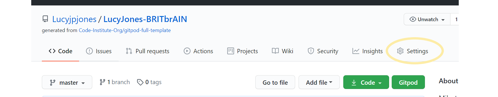

3. Scroll down the Settings page until you locate the "GitHub Pages" Section.

4. Under "Source", click the dropdown called "None" and select "Master Branch".

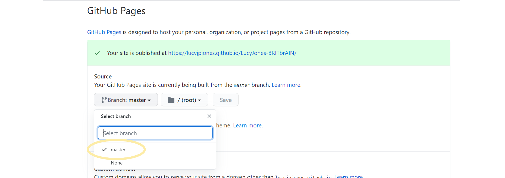

5. The page will automatically refresh.

6. Scroll back down through the page to locate the now published site link in the "GitHub Pages" section.

#### Accessing code

Follow the steps below if you are wanting to propose changes to the project or to use the project as a starting point for your own idea.

- **Forking the GitHub Repository**

  Forking allows you to create a copy of the original repository and propose changes to the repository owner via a pull request.

  1. Log in to GitHub and locate the GitHub Repository

  2. At the top of the Repository (not top of page) just above the "Settings" button on the menu, locate the "Fork" button.

  

  3. You should now have a copy of the original repository in your GitHub account.

- **Making a Local Clone**

When you clone a repository, the repository is copied on to your local machine.

1. Log in to GitHub and locate the GitHub Repository.

2. Under the repository name, click the "download code" option.

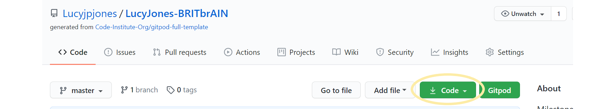

3. To clone the repository using HTTPS, under "Clone with HTTPS", copy the link.


4. Open Git Bash

5. Change the current working directory to the location where you want the cloned directory to be made.

6. Type git clone, and then paste the URL you copied in Step 3.

```
$ git clone https://github.com/YOUR-USERNAME/BRITbrAIN.git
```

7. Press Enter. Your local clone will be created.

```
$ git clone https://github.com/YOUR-USERNAME/BRITbrAIN.git

> Cloning into `BRITbrAIN`...
> remote: Enumerating objects: 299, done.
> remote: Counting objects: 100%, (299/299),  done.
> remote: Compressing objects: 100% (156/156), done.
> Receiving objects: remove: Total 299 (delta 145), reused 267 (delta 126), pack-reused 0
> Receiving objects: 100% (299/299), 4.61MiB | 2.98 MiB/s, done.
> Resolving deltas: 100% (145/145), done. Unpacking objects: 100% (10/10), done.
```

Now, you have a local copy of your fork of the BRITbrAIN repository.

> Note: The repository name and output numbers that you see on your computer, representing the total file size, etc, may differ from the example I have provided above.

---

## &rarr; **Testing**

#### Testing user stories

Testing my user's <u>key priorities</u>:

**1. A user-friendly site that is easy to navigate**

- Site includes the main dropdown menu and also scroll navigation arrows on the home-page.
- Navigation menu is fixed so is always visible to the user.

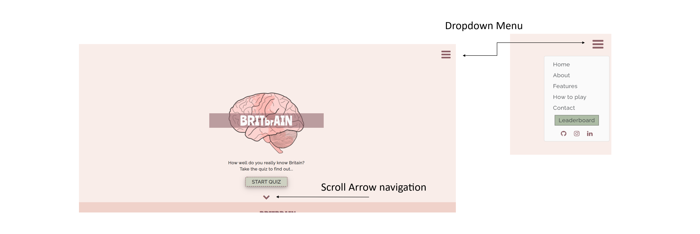

- <u>404 Error page</u>: I decided to create a custom 404.html page for my user to ensure that if they are directed to a non-existent page, they are presented with a pleasant screen and an easy navigation button back to the homepage.


**2. An enjoyable, interactive quiz to play.**

- An interactive quiz with questions based on Britain.


**3. An easily accessible button to start the quiz**

- 'Start Quiz' button visible to the user on the first view of the site.

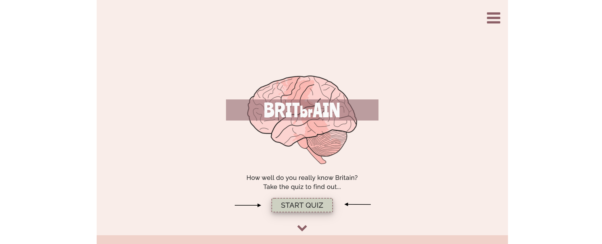

**4. Clear instructions for the user on how to play**

- Instructions on 'How to play' is located on the home-page and can be navigated to through the main menu or same page scroll arrows.

- When the user clicks start game they are presented with a pop-up box 'how to play?' before they begin.

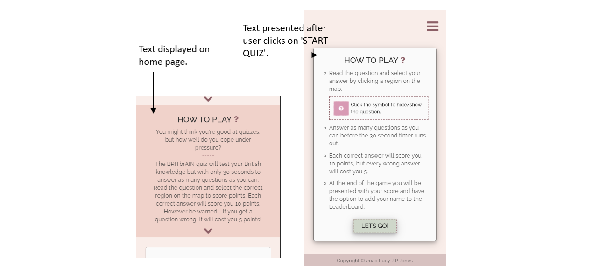

**5. Recorded score and leaderboard, for the user to check personal performance and ranking against other players**

- Score counter displayed at the top left of the question page to keep track of the user's score.

- When the timer ends, the final score is presented to the user.

- User can enter their name and submit their score to the leaderboard.

- Leaderboard shows the top 10 scores to the user using local storage.


**6. A question counter to keep track of the user's progress throughout the quiz**

- Question counter displayed at the top right of the page to keep track of the question number.


**7. A quiz timer to limit the length of the game.**

- Timer visible on the question page once the game has started.
- Timer limit is a total of 30 seconds with the game automatically ending when it reaches 0.


**8. Ability to contact me through an online form**

- Contact form on the landing page linked directly to my Gmail account allowing the user to easily get in touch.

- Easily navigated to form through the main menu or the scroll arrows located on home-page.


**9. About us and features section on site**

- 'About us' and 'features' section found on the home-page and easily navigated to through the main menu or same page scroll arrows.

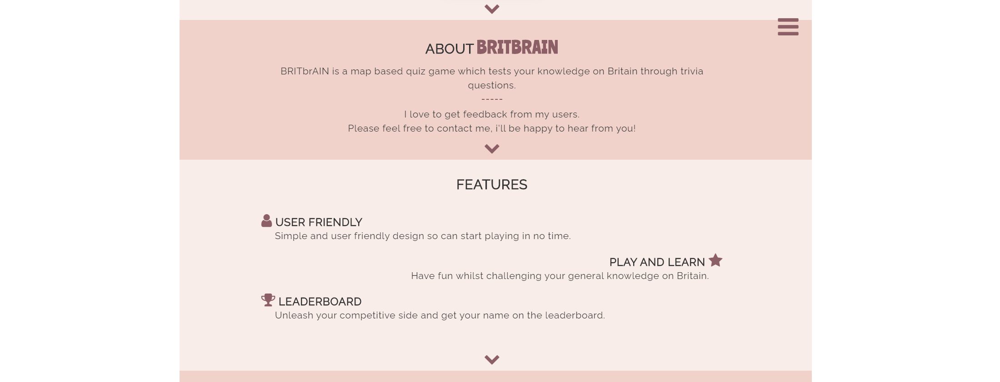

**10. Links to external social media sites**

- Social media links found on the main menu.

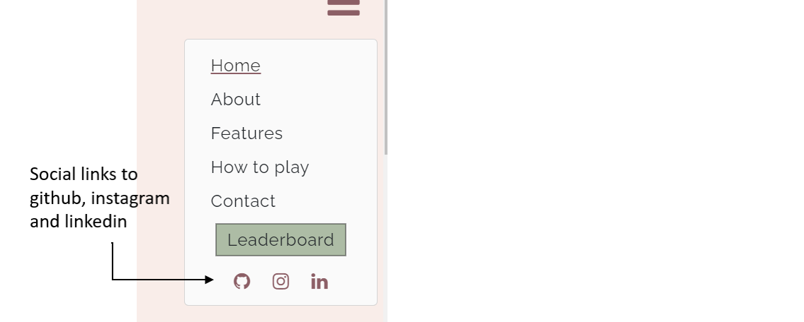

#### Manual function testing

To ensure my site was working correctly I carried out some manual function testing;

**1. Site navigation**

- I checked the site dropdown menu was working correctly by starting on the home-page and navigating around the site from and to every screen the user would be faced with.
- I checked the scroll navigation arrows were working by clicking through each section one by one.
- Links to external social platforms were checked by ensuring that when the icons were clicked the user would be navigated to the correct site opened on a new window. This was tested from every page on the site.
- 404 Error page was tested by creating a broken link in the game URL and making sure it responded with my custom page.

**2. Hover, focus and active effects**

- Hovered over the following button elements to ensure the correct brightness effects were in place;
  - 'Leaderboard' link in dropdown menu
  - social icons in dropdown menu
  - 'Send' button on contact form
  - 'Start quiz' button
  - 'Let's go' button
  - 'Submit', 'Play again' and 'Leaderboard' buttons on end screen

**3. Score countdown function**

- To check that the score count was adding and subtracting correctly depending on the user's selected answer, I clicked 'Start quiz' and went on to click a right answer and then a wrong. Ten points were added for the first, and minus five for the second so I knew the functions were working correctly.

**4. Question counter function**

- I checked the value after each time a new question was given to make sure the question counter was increasing by one every time. This confirmed that the function was working well.

**5. Timer countdown and animation**

- To test the timer function was correctly in place, I began by clicking the start button. The countdown inner text began at thirty and decreased by one every second until the timer hit zero and the game ended. The game end pop-up always popped up when the timer reached zero which showed it was functioning as it should be.

**6. Toggle function**

- To check the toggle was working I started the game and clicked the button once to hide the question then again to see if the question reappeared, and it did. This was tested throughout multiple questions.

**7. Shuffled questions**

- I played the quiz multiple times to ensure that each time the questions appeared they were different and also that none were repeated more than once. This was indeed the case so I knew the maths behind the shuffled question was working correctly.

**8. Sending email via contact form using emailJS**

- I added alerts to my javascript file for when a message was sent with success or had failed.
- I filled out the contact form and sent myself a message multiple times from different devices to see if I received it to my Gmail account, which I did.

**9. Leaderboard name and score input**

- To ensure the names and scores were adding correctly to the leaderboard I played multiple times to see if the name and score matched correctly.
- I also played over 10 times to ensure that the top 10 best scores were the ones being kept on the leaderboard.

**10. Submitting score only when the username is entered**

- I played the game and when presented with the end pop-up I tried to submit my score before entering my username. As desired, the button was not clickable until I had entered text into the input box.

#### Validator checks

The W3C Markup Validator and W3C CSS Validator Services were used to validate every page of the project to ensure there were no syntax errors in the project. Code was entered through direct input. JS hint was used to check for any errors with my Javascript files.

- [**HTML Validator**](https://validator.w3.org/nu/#textarea)

  No error or warning messages received.

- [**CSS Validator**](https://jigsaw.w3.org/css-validator/#validate_by_input)

  One warning message received;

  

  Code not altered as this is a valid CSS property as referred in [MDN web docs](https://developer.mozilla.org/en-US/docs/Web/CSS/padding-inline-start).

- [**JS hint**](https://jshint.com/)

  <u>Warnings received;</u>

  > 'const' is available in ES6 (use 'esversion: 6') or Mozilla JS extensions (use moz).

  > 'arrow function syntax (=>)' is only available in ES6 (use 'esversion: 6').

  > 'template literal syntax' is only available in ES6 (use 'esversion: 6').

  Warnings occurred as JShint is using ECMAScript 5.1 specification and my code uses ECMAScript 6 specific syntax. However, all code is valid.

  <u>Undefined variables;</u>

  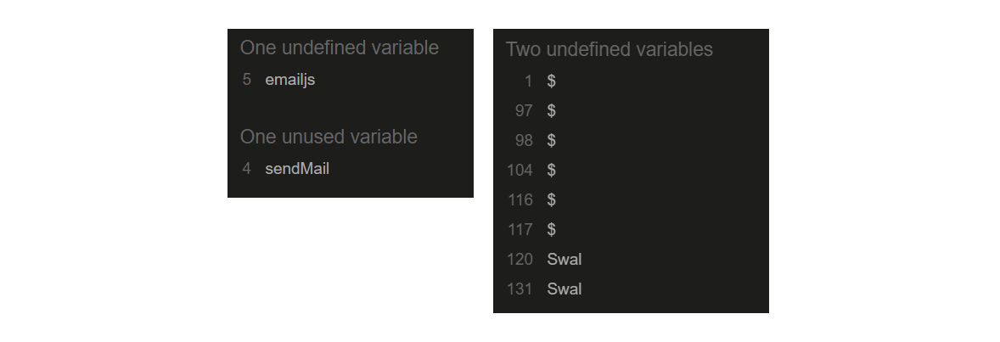

  - EmailJS defined in index.html
  - \$ (Jquery) defined in HTML files.
  - Swal defined in questions.html.

#### Audits

[Lighthouse](https://developers.google.com/web/tools/lighthouse) was used to run a series of audits to improve the quality of web pages. Overall performance and errors highlighted below.

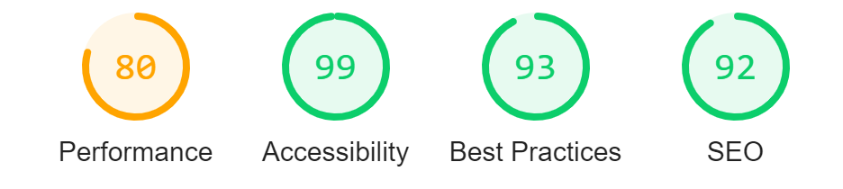

<u>Performance</u>

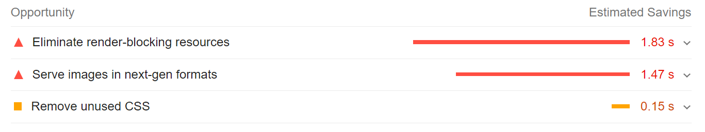

- Serve images in next-gen formats;

I tried changing my image to a different format as suggested however, changing using JPEG format gave a black background by default and WebP was accessible on less browsers. Therefore I have kept my image in a PNG format.

- Eliminate render-blocking resources and unused CSS;

Using the Coverage tab in Chrome DevTools I identified that the main file linked to these issues was the Bootstrap CSS (See screenshot below). As this is a third-party file and isn't causing noticable restrictions to my site I have chosen to not to act on this.

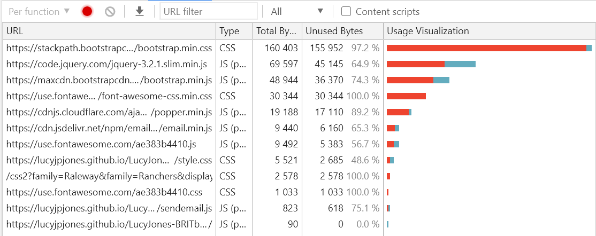

<u>Accessibility</u>

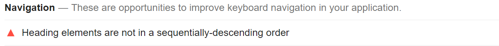

- Heading elements are not in a sequentially-descending order;

I wanted to keep the same level header for my footer throughout all pages of my site so it was consistent and easily styled through CSS.

<u>Best practices</u>

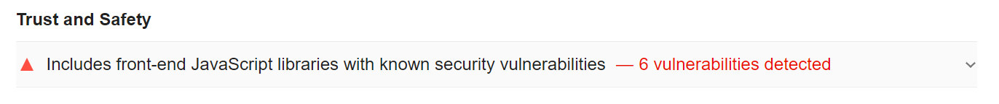

- Includes front-end JavaScript libraries with known security vulnerabilities.

Although suggested, I decided not to remove the third-party libraries with warnings as they are widely used by developers.

<u>SEO</u>

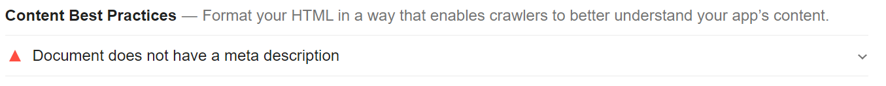

- Document does not have a meta description.

All my HTML are given a meta name and content so I am unsure why I am receiving this warning.

#### Responsive Design

- Site created as a mobile-first design inline with Bootstrap.

- Viewport tag included in the head of HTML files to tell the browser how to respond to different resolutions, particularly mobile ones.

- Media queries used in the CSS file to target larger devices.

- [Troy](http://troy.labs.daum.net/) was used for viewing the game on a range of devices.

#### Additional Testing

- The Website was tested on Google Chrome, Internet Explorer, Safari browsers, Firefox and Edge. Internet Explorer was the only browser experiencing errors, details added to bugs section.

  - To ensure my users get the best experience I decided to create an alert message for any users on Internet Explorer to switch to chrome;

  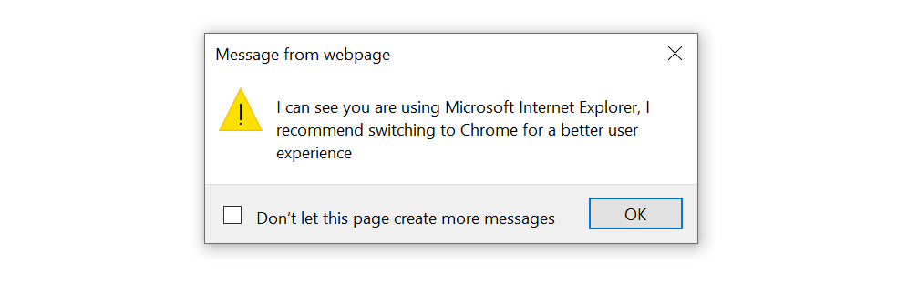

  To test that this was working I added a temporary alert to my HTML file for any browsers that weren't Internet Explorer;

  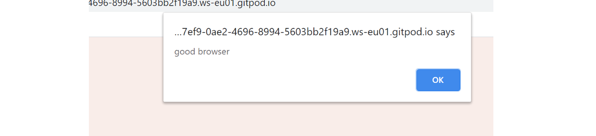

- The website was viewed on a variety of devices including Laptop, Macbook, Ipad and IPhones (Version 6,8).

- Friends and family members were asked to review the site to point out any bugs, user experience issues and/or suggestions.

  - Feedback action:

    - 'I was not able to click on north-east as the question was blocking the region'. Although this is explained in the 'how to play?' I found that many users were going straight into the game and skipping the instructions. Taking this into consideration I decided to add another function that hid the question when a user hovered over to allow the user to easily click onto the region.

- Project posted on Slack, asking for feedback from fellow students.

#### Bugs

|     | Bug                                                                               | Action                                                                                                                                                                                                                      |
| --- | --------------------------------------------------------------------------------- | --------------------------------------------------------------------------------------------------------------------------------------------------------------------------------------------------------------------------- |
| [X] | Hex 8 digit colours not compatible with Internet Explorer                         | Used a converter to change all 8 digit hex colours to rgba format                                                                                                                                                           |
| [ ] | Javascript errors showing in Internet Explorer and not allowing the game to begin | As Internet Explorer is coming increasingly less popular, in addition to Microsoft ending support next year I decided not to fix this code. Instead, I have added an alert message for anyone using IE to switch to chrome. |
| [ ] | Glitch with the timer during the countdown, giving users more time                | As this has only occurred twice I have not yet been able to identify the problem                                                                                                                                            |
| [ ] | Questions being repeated more than once                                           | This has only occurred once during my testing making it difficult for me to identify the problem                                                                                                                            |

## &rarr; **Credits**

#### Content

- [Bootstrap 4.5](https://getbootstrap.com/): Bootstrap Library used throughout the project, components used include the grid System, forms, buttons, modals, nav menu, leaderboard table

- [css-tricks.com](https://css-tricks.com/)

- [w3schools.com](https://www.w3schools.com/)

- [codepen.io](https://codepen.io/):

  - [Countdown timer with SVG circle](https://codepen.io/zebateira/pen/VvqJwm?css-preprocessor=none): Helped with code for the game timer.
  - [UK clickable map](https://codepen.io/vaughan1/pen/ZXOxKW): Helped with code for displaying the clickable map regions.

- [youtube.com](youtube.com):

  - [Build A Quiz App With JavaScript](https://www.youtube.com/watch?v=riDzcEQbX6k): Helped with general quiz code structure for javascript file.
  - [Build A Quiz App- James Q Quick](https://www.youtube.com/playlist?list=PLDlWc9AfQBfZIkdVaOQXi1tizJeNJipEx): Helped when writing code for javascript Leaderboard and a separate file for JSON questions.

- [sitpoint.com](https://www.sitepoint.com/):

  - [How to Make a Simple JavaScript Quiz](https://www.sitepoint.com/simple-javascript-quiz/): Helped with general code structure for javascript file.

- [codeinstitute.net](https://courses.codeinstitute.net/): Sending Emails Using EmailJS.

- [dev.to](https://dev.to/nzonnenberg/making-an-animated-timer-with-css--javascript-jpa): Helped with animation for the countdown timer.

- [8-digit-hex-converter.website](https://8-digit-hex-converter.website/): Used to convert 8 digit hex colours into rgba format.

- [HTML Dog](https://htmldog.com/techniques/404/): Helped with creating custom error page '404'.

- [StackOverflow](https://stackoverflow.com/questions/49185495/how-to-tell-user-to-open-page-in-chrome-with-browser-detect) and [javascriptkit.com](http://www.javascriptkit.com/javatutors/navigator.shtml) used to help create an alert for users using Internet Explorer.

#### Media

- [pixabay.com](https://pixabay.com/): Brain image for the game logo.

- [mapchart.net](https://mapchart.net/): map image for the game logo.

- The mockup image showing all devices on my README.md was created using [About Am I Responsive](http://ami.responsivedesign.is/)

#### Acknowledgements

- My Mentor for continuous help and support throughout the project.

- The [Code Institute](https://codeinstitute.net/) Slack Community.

- Friends & Family for continuous feedback and support.

## &rarr; **Contact**

Created by @lucyjpjones

If you have any problems, questions or suggestions for my project please contact me on the email below:

```
lucyjpjones@gmail.com
```

Thanks for visiting.

&copy;
LucyJPJones
